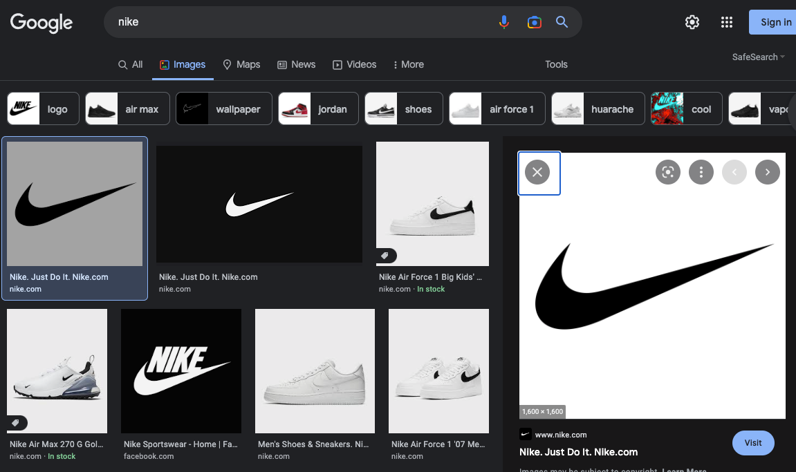
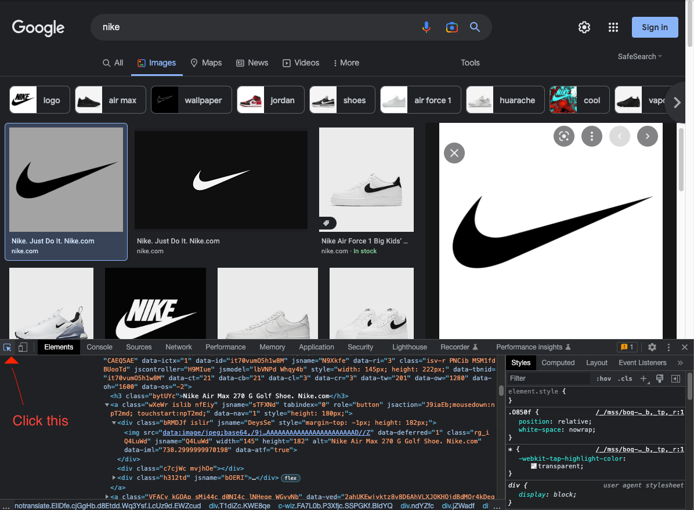
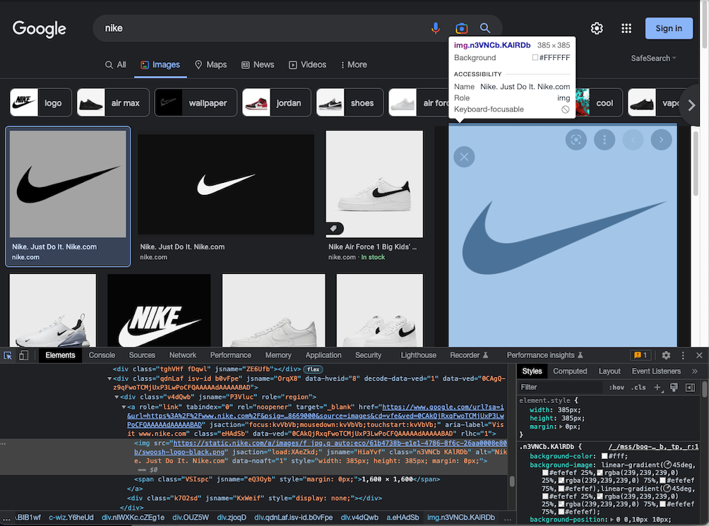
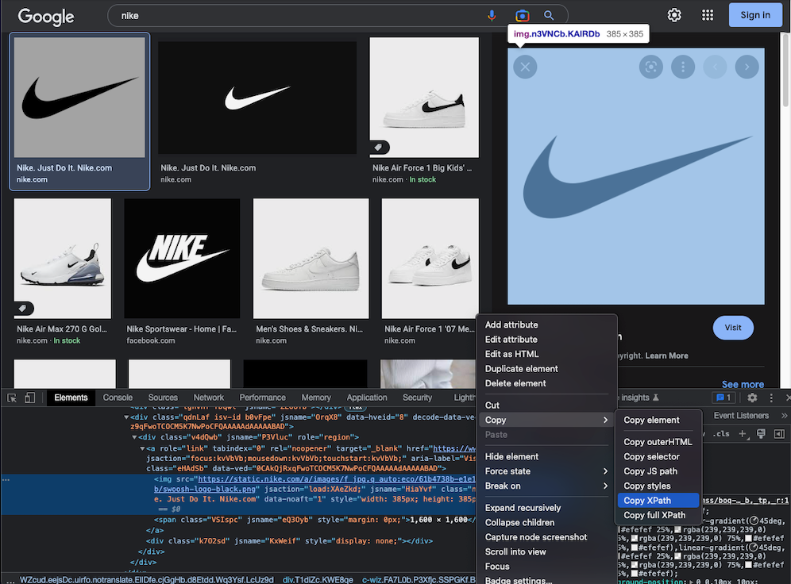
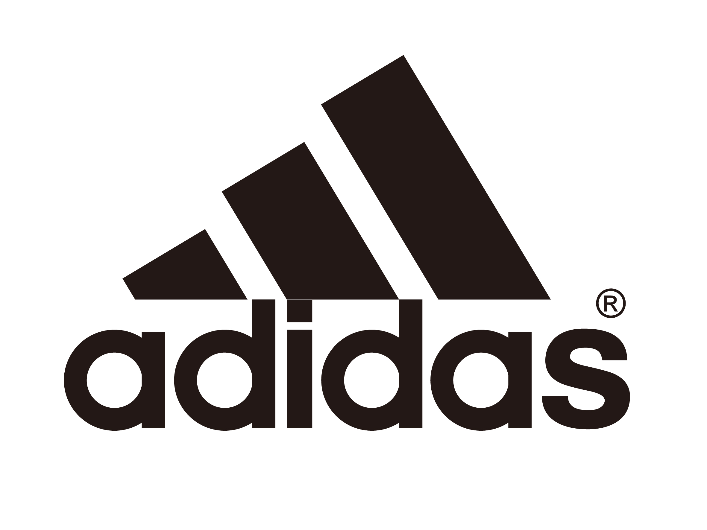

# Google Image Crawl

This repo is fork from https://github.com/changhyeonnam/Google-Full-size-image-crawler

This repo is for crawling full size image in the google search.

### Development Environment

- WEB : Chrome Version 119.0.6045.105 (Official Build) (x86_64)
- OS : Window
- IDE : Visual Studio Code - Insiders

### Dependency

```
selenium == 4.4.3
```

### How to use crawler

1. Download suitable chrome driver. <p>Follow this [link](https://chromedriver.chromium.org/downloads).</p>
2. You should specify PATH in `webdriver.Chrome()`
   ```python
    PATH="./chromedriver"
    driver = webdriver.Chrome(executable_path=PATH)
   ```
3. You should specify full size image xpath in chorme.

   1. Do search
      
   2. Go to inspect, and click upper left mouse icon.
      
   3. click full size image, and go to inspect.
      
   4. copy xpath.
      

4. replace copied xpath with copied variable.
   ```python
    copied_xpath='//*[@id="Sva75c"]/div/div/div[3]/div[2]/c-wiz/div/div[1]/div[1]/div[3]/div/a/img'
   ```
5. Run the code!. <p>Follow command like this. "python main.py"</p>

   ```python
   # change keyword & num of downloads in main.py

   search_list = [
      [keyword, num_of_downloads]
   ]
   ```

### Example

```python
**************************************************Crawlling started.**************************************************
Image saved: 아디다스_1.jpg
Image saved: 아디다스_2.jpg
Image saved: 아디다스_3.jpg
Image saved: 아디다스_4.jpg
**************************************************Crawlling Completed.**************************************************
```

### Output



### Info

- I'm not sure but copied xpath can be reused for different search term.
- I guess that when chrome is updated or google updated their search engine, we should copy again.
- I recommend using this program in virtual machine
